# IAM Roles Anywhere Cross-Account Setup Guide

## Document Updates

**Last Updated**: December 2024  
**Version**: 2.0  
**Changes**:
- Added comprehensive OpenSSL-based setup section
- Included Windows step-by-step instructions
- Enhanced engineer notes throughout
- Fixed S3 bucket naming security issues
- Added certificate lifecycle management
- Completed troubleshooting sections

## Overview
This guide covers setting up IAM Roles Anywhere where:
- **Account A**: Contains ACM Private CA (Certificate Authority)
- **Account B**: Contains IAM Roles Anywhere configuration

### Engineer Notes
**Why Cross-Account Setup?**
- **Centralized CA Management**: Keep certificate authority in dedicated security account
- **Separation of Concerns**: CA operations separate from application access

- **Security**: Limits who can issue certificates vs who can use them

## Architecture Diagram

```mermaid
graph TB
    subgraph "Account A - Certificate Authority"
        PCA["🔐 ACM Private CA"]
        ROOT["📜 Root Certificate"]
        INTER["📋 Intermediate Certificate"]
    end
    
    subgraph "Account B - IAM Roles Anywhere"
        TA["🎯 Trust Anchor"]
        PROFILE["👤 Profile"]
        ROLE["🔑 IAM Role"]
        CLIENT["💻 Client Application"]
    end
    
    subgraph "External Environment"
        CERT["📄 Client Certificate"]
        KEY["🔐 Private Key"]
    end
    
    PCA --> ROOT
    ROOT --> INTER
    INTER --> CERT
    CERT --> TA
    TA --> PROFILE
    PROFILE --> ROLE
    CLIENT --> CERT
    CLIENT --> KEY
    
    style PCA fill:#ff9999
    style TA fill:#99ff99
    style PROFILE fill:#99ff99
    style ROLE fill:#99ff99
```



## Prerequisites

### Account A (Certificate Authority)
- ACM Private CA already deployed
- Cross-account permissions configured
- Root/Intermediate CA certificates available

### Account B (IAM Roles Anywhere)
- IAM permissions to create roles and policies
- Access to Account A's CA certificates
- AWS CLI configured with appropriate permissions

## Step 1: Account A - Export CA Certificate

### Engineer Notes
**What's Happening**: Exporting the CA certificate that will be used as the trust anchor in Account B
**Key Point**: The CA certificate is public information - it's safe to copy between accounts
**Common Issue**: Make sure you're using the correct region where your PCA is deployed

### 1.1 Get CA Certificate ARN
```bash
aws acm-pca list-certificate-authorities --region us-east-1
```

### 1.2 Export Root CA Certificate
```bash
# Export root CA certificate
aws acm-pca get-certificate-authority-certificate \
    --certificate-authority-arn arn:aws:acm-pca:us-east-1:ACCOUNT-A:certificate-authority/12345678-1234-1234-1234-123456789012 \
    --output text \
    --query Certificate > root-ca.pem

# Export certificate chain (if using intermediate CA)
aws acm-pca get-certificate-authority-certificate \
    --certificate-authority-arn arn:aws:acm-pca:us-east-1:ACCOUNT-A:certificate-authority/12345678-1234-1234-1234-123456789012 \
    --output text \
    --query CertificateChain > ca-chain.pem
```

### 1.3 Configure Cross-Account Access (Account A)

### Engineer Notes
**Purpose**: Allows Account B to issue certificates from Account A's PCA
**Security**: Uses account-level trust - restrict further with specific IAM users/roles in production
**Actions Explained**:
- `GetCertificateAuthorityCertificate`: Download CA cert for trust anchor
- `IssueCertificate`: Request new certificates
- `GetCertificate`: Retrieve issued certificates

```json
{
    "Version": "2012-10-17",
    "Statement": [
        {
            "Sid": "AllowAccountBAccess",
            "Effect": "Allow",
            "Principal": {
                "AWS": "arn:aws:iam::ACCOUNT-B:root"
            },
            "Action": [
                "acm-pca:GetCertificateAuthorityCertificate",
                "acm-pca:IssueCertificate",
                "acm-pca:GetCertificate"
            ],
            "Resource": "arn:aws:acm-pca:us-east-1:ACCOUNT-A:certificate-authority/*"
        }
    ]
}
```

## Step 2: Account B - Create IAM Role

### Engineer Notes
**Purpose**: Create the IAM role that clients will assume using their certificates
**Key Concept**: The trust policy uses certificate attributes (CN, OU, etc.) to control access
**Security**: Only certificates with matching CN can assume this role
**Flexibility**: You can use multiple certificate attributes for fine-grained control

### 2.1 Create Trust Policy for IAM Role
### Engineer Notes
**Principal Explained**: `rolesanywhere.amazonaws.com` is the AWS service that validates certificates
**Condition Breakdown**: 
- `aws:PrincipalTag/x509Subject/CN`: Certificate's Common Name field
- `client.example.com`: Must match exactly what's in your certificate
- **Other options**: `/OU` (Organizational Unit), `/O` (Organization), `/C` (Country)

```json
{
    "Version": "2012-10-17",
    "Statement": [
        {
            "Effect": "Allow",
            "Principal": {
                "Service": "rolesanywhere.amazonaws.com"
            },
            "Action": "sts:AssumeRole",
            "Condition": {
                "StringEquals": {
                    "aws:PrincipalTag/x509Subject/CN": "client.example.com"
                }
            }
        }
    ]
}
```

### 2.2 Create IAM Role
```bash
# Create trust policy file
cat > trust-policy.json << 'EOF'
{
    "Version": "2012-10-17",
    "Statement": [
        {
            "Effect": "Allow",
            "Principal": {
                "Service": "rolesanywhere.amazonaws.com"
            },
            "Action": "sts:AssumeRole",
            "Condition": {
                "StringEquals": {
                    "aws:PrincipalTag/x509Subject/CN": "client.example.com"
                }
            }
        }
    ]
}
EOF

# Create IAM role
aws iam create-role \
    --role-name RolesAnywhereClientRole \
    --assume-role-policy-document file://trust-policy.json \
    --description "Role for IAM Roles Anywhere clients"

# Attach permissions policy
aws iam attach-role-policy \
    --role-name RolesAnywhereClientRole \
    --policy-arn arn:aws:iam::aws:policy/ReadOnlyAccess
```

## Step 3: Account B - Create Trust Anchor

### Engineer Notes
**What is Trust Anchor?**: Links your CA certificate to IAM Roles Anywhere service
**Think of it as**: "I trust certificates issued by this CA"
**Root vs Chain**: Use root CA for simple setups, full chain for intermediate CAs
**Validation**: AWS validates client certificates against this trust anchor

### 3.1 Create Trust Anchor with CA Certificate
```bash
# Create trust anchor using root CA certificate
aws rolesanywhere create-trust-anchor \
    --name "CrossAccountCA" \
    --source sourceType=CERTIFICATE_BUNDLE,sourceData=file://root-ca.pem \
    --enabled \
    --region us-east-1
```

### 3.2 Alternative: Create Trust Anchor with Certificate Chain
```bash
# If using intermediate CA, use the full chain
aws rolesanywhere create-trust-anchor \
    --name "CrossAccountCAChain" \
    --source sourceType=CERTIFICATE_BUNDLE,sourceData=file://ca-chain.pem \
    --enabled \
    --region us-east-1
```

## Step 4: Account B - Create Profile

**What is the Profile?**
The IAM Roles Anywhere Profile is a configuration object that:
- **Links Trust Anchors to IAM Roles**: Connects your certificate authority (trust anchor) to specific IAM roles
- **Defines Session Parameters**: Sets session duration, conditions, and role mapping rules
- **Acts as Authorization Policy**: Determines which certificates can assume which roles
- **Enables Certificate-to-Role Mapping**: Maps certificate attributes (like CN, OU) to specific AWS roles

**Why is it needed?**
- **Security Layer**: Provides additional control beyond just certificate validation
- **Role Selection**: Allows one trust anchor to map to multiple roles based on certificate attributes
- **Session Management**: Controls how long the temporary credentials are valid
- **Audit Trail**: Provides a named resource for CloudTrail logging and monitoring

### 4.1 Get Role ARN and Trust Anchor ARN
```bash
# Get role ARN
aws iam get-role --role-name RolesAnywhereClientRole --query 'Role.Arn' --output text

# Get trust anchor ARN
aws rolesanywhere list-trust-anchors --query 'trustAnchors[0].trustAnchorArn' --output text
```

### 4.2 Create Profile
```bash
aws rolesanywhere create-profile \
    --name "ClientProfile" \
    --role-arns arn:aws:iam::ACCOUNT-B:role/RolesAnywhereClientRole \
    --enabled \
    --duration-seconds 3600 \
    --region us-east-1
```

## Step 5: Generate Client Certificate

**Console vs CLI Requirements:**
- **Step 5.1 (CSR Generation)**: **Must use CLI/OpenSSL** - AWS Console cannot generate private keys or CSRs
- **Step 5.2 (Certificate Issuance)**: **Can use Console or CLI** - Both options available

### 5.1 Create Certificate Signing Request (CSR)
**Note**: This step **requires OpenSSL CLI** - cannot be done via AWS Console

### Engineer Notes
**Why OpenSSL?**: AWS never sees your private key - you generate it locally for security
**Key Size**: 2048-bit RSA is minimum, 4096-bit for higher security
**File Security**: Keep `client.key` secure - this is your authentication credential
**CN Importance**: Must match the condition in your IAM role trust policy

```bash
# Generate private key
openssl genrsa -out client.key 2048

# Create CSR configuration
### Engineer Notes
# **CN (Common Name)**: Must match IAM role trust policy condition
# **O/OU**: Can be used for additional access control conditions
# **keyUsage**: Defines what the certificate can be used for
# **extendedKeyUsage**: clientAuth is required for IAM Roles Anywhere

cat > client.conf << 'EOF'
[req]
distinguished_name = req_distinguished_name
req_extensions = v3_req
prompt = no

[req_distinguished_name]
CN = client.example.com
O = Example Organization
OU = IT Department
C = US

[v3_req]
keyUsage = keyEncipherment, dataEncipherment, digitalSignature
extendedKeyUsage = clientAuth
EOF

# Generate CSR
openssl req -new -key client.key -out client.csr -config client.conf
```

### 5.2 Issue Certificate via Account A's PCA

#### Option A: Using AWS CLI
```bash
# Issue certificate using Account A's PCA
aws acm-pca issue-certificate \
    --certificate-authority-arn arn:aws:acm-pca:us-east-1:ACCOUNT-A:certificate-authority/12345678-1234-1234-1234-123456789012 \
    --csr fileb://client.csr \
    --signing-algorithm SHA256WITHRSA \
    --template-arn arn:aws:acm-pca:::template/EndEntityClientAuthCertificate/V1 \
    --validity Value=365,Type=DAYS \
    --region us-east-1

# Get certificate ARN from output, then retrieve certificate
aws acm-pca get-certificate \
    --certificate-authority-arn arn:aws:acm-pca:us-east-1:ACCOUNT-A:certificate-authority/12345678-1234-1234-1234-123456789012 \
    --certificate-arn arn:aws:acm-pca:us-east-1:ACCOUNT-A:certificate-authority/12345678-1234-1234-1234-123456789012/certificate/abcdef12-3456-7890-abcd-ef1234567890 \
    --output text \
    --query Certificate > client.crt
```

#### Option B: Using AWS Console (Account A)
1. **Navigate to ACM Private CA Console**
   - Go to AWS Console → Certificate Manager → Private CAs
   - Select your Private CA

2. **Issue Certificate**
   - Click "Issue certificate" button
   - Select "Issue an end-entity certificate"

3. **Configure Certificate Request**
   - **Certificate signing request (CSR)**: Upload the `client.csr` file created in step 5.1
   - **Certificate template**: Select "EndEntityClientAuthCertificate/V1"
   - **Signing algorithm**: SHA256WITHRSA
   - **Validity period**: 365 days

4. **Review and Issue**
   - Review settings and click "Issue certificate"
   - Wait for certificate status to change to "Issued"

5. **Download Certificate**
   - Click on the issued certificate
   - Click "Download certificate body"
   - Save as `client.crt`

6. **Alternative: Copy Certificate from Console**
   ```bash
   # Copy certificate text from console and save to file
   cat > client.crt << 'EOF'
   -----BEGIN CERTIFICATE-----
   [Paste certificate content from console here]
   -----END CERTIFICATE-----
   EOF
   ```

## Step 6: Install AWS CLI Credential Helper

**Note**: Install `aws_signing_helper` on the **client machine** where you need AWS access (your workstation, on-premises server, etc.)

### Engineer Notes
**What is aws_signing_helper?**: AWS-provided binary that handles certificate-based authentication
**How it works**: Intercepts AWS CLI calls and uses your certificate instead of access keys
**Security**: Signs requests using your private key, proves certificate ownership
**Compatibility**: Works with any AWS SDK that supports credential_process

### 6.1 Install aws_signing_helper
```bash
# Download for Linux/macOS
curl -o aws_signing_helper https://rolesanywhere.amazonaws.com/releases/1.0.5/X86_64/Linux/aws_signing_helper
chmod +x aws_signing_helper
sudo mv aws_signing_helper /usr/local/bin/

# Download for Windows
# Download from: https://rolesanywhere.amazonaws.com/releases/1.0.5/X86_64/Windows/aws_signing_helper.exe
```

### 6.2 Configure AWS CLI Profile

**Note**: Configure this on the **same client machine** where you installed `aws_signing_helper`

### Engineer Notes
**credential_process**: AWS CLI feature that calls external program for credentials
**File Paths**: Use absolute paths if certificates aren't in current directory
**ARN Requirements**: Need all three ARNs - trust anchor, profile, and role
**Profile Name**: Can be anything - use descriptive names for multiple profiles

```bash
# Add to ~/.aws/config
cat >> ~/.aws/config << 'EOF'
[profile rolesanywhere]
credential_process = aws_signing_helper credential-process \
    --certificate client.crt \
    --private-key client.key \
    --trust-anchor-arn arn:aws:rolesanywhere:us-east-1:ACCOUNT-B:trust-anchor/12345678-1234-1234-1234-123456789012 \
    --profile-arn arn:aws:rolesanywhere:us-east-1:ACCOUNT-B:profile/12345678-1234-1234-1234-123456789012 \
    --role-arn arn:aws:iam::ACCOUNT-B:role/RolesAnywhereClientRole
EOF
```

## Step 7: Test Configuration

### Engineer Notes
**First Test**: `get-caller-identity` confirms authentication works
**Expected Output**: Should show assumed role ARN, not your original user
**Common Issues**: Certificate/key file paths, expired certificates, wrong ARNs
**Success Indicator**: Role ARN contains "RolesAnywhereClientRole"

### 7.1 Test AWS CLI Access
```bash
# Test with the new profile
aws sts get-caller-identity --profile rolesanywhere

# Test service access
aws s3 ls --profile rolesanywhere
```

### 7.2 Verify Certificate Chain

### Engineer Notes
**Purpose**: Confirm certificate is valid and properly signed by your CA
**Expected Output**: "client.crt: OK" means certificate is valid
**Certificate Details**: Check expiration date, CN, and key usage extensions
**Chain Validation**: Ensures trust relationship is properly established

```bash
# Verify client certificate against CA
openssl verify -CAfile root-ca.pem client.crt

# Check certificate details
openssl x509 -in client.crt -text -noout
```

## Step 8: Troubleshooting

### 8.1 Common Issues

#### Certificate Validation Errors
**Run on**: Client machine (where certificates are stored)
```bash
# Check certificate expiration
openssl x509 -in client.crt -noout -dates

# Verify certificate chain
openssl verify -verbose -CAfile ca-chain.pem client.crt
```

#### Trust Anchor Issues
**Run on**: Any machine with AWS CLI access to Account B
```bash
# List trust anchors
aws rolesanywhere list-trust-anchors --region us-east-1

# Check trust anchor status
aws rolesanywhere get-trust-anchor --trust-anchor-id 12345678-1234-1234-1234-123456789012
```

#### Profile Configuration Issues
**Run on**: Any machine with AWS CLI access to Account B
```bash
# List profiles
aws rolesanywhere list-profiles --region us-east-1

# Check profile configuration
aws rolesanywhere get-profile --profile-id 12345678-1234-1234-1234-123456789012
```

### 8.2 Debug Commands

### Engineer Notes
**Debug Strategy**: Start with credential helper directly, then test AWS CLI
**Common Errors**:
- "Certificate validation failed": Check certificate chain and expiration
- "Access denied": Verify cross-account permissions and role trust policy
- "Invalid ARN": Double-check all ARN formats and account IDs
- "File not found": Use absolute paths for certificate files

```bash
# Enable debug logging
export AWS_DEBUG=1
aws sts get-caller-identity --profile rolesanywhere

# Test credential helper directly
aws_signing_helper credential-process \
    --certificate client.crt \
    --private-key client.key \
    --trust-anchor-arn arn:aws:rolesanywhere:us-east-1:ACCOUNT-B:trust-anchor/12345678-1234-1234-1234-123456789012 \
    --profile-arn arn:aws:rolesanywhere:us-east-1:ACCOUNT-B:profile/12345678-1234-1234-1234-123456789012 \
    --role-arn arn:aws:iam::ACCOUNT-B:role/RolesAnywhereClientRole \
    --debug
```

## Security Best Practices

### Certificate Management
- Store private keys securely (HSM, encrypted storage)
- Implement certificate rotation procedures
- Monitor certificate expiration dates
- Use least privilege for IAM role permissions

### Trust Anchor Security
- Regularly audit trust anchor configurations
- Monitor for unauthorized certificate issuance
- Implement certificate revocation procedures
- Use condition-based trust policies

### Cross-Account Security
- Limit PCA access to specific principals
- Monitor cross-account certificate requests
- Implement CloudTrail logging for all operations
- Regular security reviews of trust relationships

## Automation Scripts

### Engineer Notes
**Automation Importance**: Manual certificate renewal is error-prone and doesn't scale
**Renewal Timing**: Renew certificates 30-60 days before expiration
**Monitoring**: Set up CloudWatch alarms for certificate expiration
**Testing**: Always test new certificates before replacing old ones

### Certificate Renewal Script
```bash
#!/bin/bash
# renew-certificate.sh

ROLE_ARN="arn:aws:iam::ACCOUNT-B:role/RolesAnywhereClientRole"
PCA_ARN="arn:aws:acm-pca:us-east-1:ACCOUNT-A:certificate-authority/12345678-1234-1234-1234-123456789012"

# Generate new CSR
openssl req -new -key client.key -out client-new.csr -config client.conf

# Issue new certificate
CERT_ARN=$(aws acm-pca issue-certificate \
    --certificate-authority-arn $PCA_ARN \
    --csr fileb://client-new.csr \
    --signing-algorithm SHA256WITHRSA \
    --template-arn arn:aws:acm-pca:::template/EndEntityClientAuthCertificate/V1 \
    --validity Value=365,Type=DAYS \
    --query CertificateArn --output text)

# Wait for certificate to be issued
sleep 10

# Retrieve new certificate
aws acm-pca get-certificate \
    --certificate-authority-arn $PCA_ARN \
    --certificate-arn $CERT_ARN \
    --output text \
    --query Certificate > client-new.crt

# Backup old certificate
mv client.crt client-old.crt
mv client-new.crt client.crt

echo "Certificate renewed successfully"
```

## Monitoring and Alerting

### CloudWatch Metrics
- Monitor certificate usage patterns
- Track authentication failures
- Alert on unusual access patterns
- Monitor cross-account API calls

### CloudTrail Events
- `AssumeRoleWithWebIdentity` events
- `CreateTrustAnchor` operations
- `CreateProfile` activities
- Certificate issuance events

This comprehensive guide provides all necessary steps for setting up IAM Roles Anywhere in a cross-account scenario with ACM Private CA.


### Using OpenSSL as anchor  For IAM Role anywhere

## Overview
This section covers setting up IAM Roles Anywhere using OpenSSL-generated certificates as the trust anchor, with an application running in Account B that needs AWS access.

### Engineer Notes
**Use Case**: When you don't have ACM Private CA but need certificate-based authentication
**Cost Benefit**: No PCA cost
**Security**: You control the entire certificate lifecycle
**Limitation**: Manual certificate management and validation

## Architecture for OpenSSL Setup


## Step 1: Create Root CA with OpenSSL

### Engineer Notes
**Where to Run**: Local machine or secure CA server (NOT in AWS)
**Security**: Root CA private key is most critical - store securely
**Purpose**: Creates the certificate authority that will sign client certificates
**File Management**: Keep CA files separate from client certificates

**Run on**: Your local workstation or dedicated CA server

### 1.1 Create CA Directory Structure
```bash
# Create CA directory structure
mkdir -p ca/{certs,crl,newcerts,private}
cd ca
echo 1000 > serial
touch index.txt
```

### 1.2 Create CA Configuration
```bash
# Create CA configuration file
cat > openssl.cnf << 'EOF'
[ ca ]
default_ca = CA_default

[ CA_default ]
dir               = .
certs             = $dir/certs
crl_dir           = $dir/crl
new_certs_dir     = $dir/newcerts
database          = $dir/index.txt
serial            = $dir/serial
RANDFILE          = $dir/private/.rand

private_key       = $dir/private/ca.key
certificate       = $dir/certs/ca.crt

crlnumber         = $dir/crlnumber
crl               = $dir/crl/ca.crl
crl_extensions    = crl_ext
default_crl_days  = 30

default_md        = sha256
name_opt          = ca_default
cert_opt          = ca_default
default_days      = 365
preserve          = no
policy            = policy_strict

[ policy_strict ]
countryName             = match
stateOrProvinceName     = match
organizationName        = match
organizationalUnitName  = optional
commonName              = supplied
emailAddress            = optional

[ req ]
default_bits        = 2048
distinguished_name  = req_distinguished_name
string_mask         = utf8only
default_md          = sha256
x509_extensions     = v3_ca

[ req_distinguished_name ]
countryName                     = Country Name (2 letter code)
stateOrProvinceName             = State or Province Name
localityName                    = Locality Name
0.organizationName              = Organization Name
organizationalUnitName          = Organizational Unit Name
commonName                      = Common Name
emailAddress                    = Email Address

[ v3_ca ]
subjectKeyIdentifier = hash
authorityKeyIdentifier = keyid:always,issuer
basicConstraints = critical, CA:true
keyUsage = critical, digitalSignature, cRLSign, keyCertSign

[ client_cert ]
basicConstraints = CA:FALSE
nsCertType = client, email
nsComment = "OpenSSL Generated Client Certificate"
subjectKeyIdentifier = hash
authorityKeyIdentifier = keyid,issuer
keyUsage = critical, nonRepudiation, digitalSignature, keyEncipherment
extendedKeyUsage = clientAuth, emailProtection
EOF
```

### 1.3 Generate Root CA
```bash
# Generate CA private key
openssl genrsa -aes256 -out private/ca.key 4096

# Generate CA certificate
openssl req -config openssl.cnf \
    -key private/ca.key \
    -new -x509 -days 7300 -sha256 -extensions v3_ca \
    -out certs/ca.crt \
    -subj "/C=US/ST=State/L=City/O=MyCompany/OU=IT/CN=MyCompany Root CA"
```

### Engineer Notes
**Password Protection**: CA key is encrypted - remember the passphrase!
**Validity Period**: 7300 days = ~20 years for root CA
**Subject Fields**: Customize C/ST/L/O/OU/CN for your organization
**Key Size**: 4096-bit for root CA provides long-term security

## Step 2: Create Client Certificate

### Engineer Notes
**Purpose**: Generate certificate that your application will use for authentication
**CN Importance**: Must match IAM role trust policy condition
**Key Management**: Client private key stays with your application
**Certificate Signing**: Signed by your root CA

**Run on**: Same machine as Step 1 (where CA files are located)

### 2.1 Generate Client Private Key
```bash
# Generate client private key (no password for application use)
openssl genrsa -out private/client.key 2048
```

### 2.2 Create Client Certificate Request
```bash
# Generate client certificate signing request
openssl req -config openssl.cnf \
    -key private/client.key \
    -new -sha256 -out client.csr \
    -subj "/C=US/ST=State/L=City/O=MyCompany/OU=Applications/CN=app.mycompany.com"
```

### 2.3 Sign Client Certificate
```bash
# Sign the client certificate with CA
openssl ca -config openssl.cnf \
    -extensions client_cert -days 365 -notext -md sha256 \
    -in client.csr \
    -out certs/client.crt

# Verify the certificate
openssl verify -CAfile certs/ca.crt certs/client.crt
```

### Engineer Notes
**Validity**: 365 days for client certificates (shorter than CA)
**Extensions**: client_cert extensions enable clientAuth usage
**Verification**: Should output "certs/client.crt: OK"
**Files Created**: client.crt (certificate) and client.key (private key)

## Step 3: Setup IAM Roles Anywhere in Account B

### Engineer Notes
**Account Context**: All commands run in Account B where your application resides
**Prerequisites**: AWS CLI configured with admin permissions in Account B
**Trust Anchor**: Uses your OpenSSL root CA certificate
**Security**: Only certificates signed by your CA can authenticate

**Run on**: Machine with AWS CLI access to Account B

### 3.1 Create IAM Role for Application
```bash
# Create trust policy for IAM role
cat > app-trust-policy.json << 'EOF'
{
    "Version": "2012-10-17",
    "Statement": [
        {
            "Effect": "Allow",
            "Principal": {
                "Service": "rolesanywhere.amazonaws.com"
            },
            "Action": "sts:AssumeRole",
            "Condition": {
                "StringEquals": {
                    "aws:PrincipalTag/x509Subject/CN": "app.mycompany.com"
                }
            }
        }
    ]
}
EOF

# Create IAM role
aws iam create-role \
    --role-name ApplicationRolesAnywhereRole \
    --assume-role-policy-document file://app-trust-policy.json \
    --description "Role for application using IAM Roles Anywhere"
```

### 3.2 Attach Application Permissions
```bash
# Create application-specific policy
cat > app-permissions.json << 'EOF'
{
    "Version": "2012-10-17",
    "Statement": [
        {
            "Effect": "Allow",
            "Action": [
                "s3:GetObject",
                "s3:PutObject",
                "s3:ListBucket"
            ],
            "Resource": [
                "arn:aws:s3:::mycompany-prod-app-bucket-12345",
                "arn:aws:s3:::mycompany-prod-app-bucket-12345/*"
            ]
        },
        {
            "Effect": "Allow",
            "Action": [
                "secretsmanager:GetSecretValue"
            ],
            "Resource": "arn:aws:secretsmanager:us-east-1:ACCOUNT-B:secret:app/*"
        }
    ]
}
EOF

# Create and attach policy
aws iam create-policy \
    --policy-name ApplicationPermissions \
    --policy-document file://app-permissions.json

aws iam attach-role-policy \
    --role-name ApplicationRolesAnywhereRole \
    --policy-arn arn:aws:iam::ACCOUNT-B:policy/ApplicationPermissions
```

### Engineer Notes
**CN Matching**: "app.mycompany.com" must match certificate CN exactly
**Permissions**: Customize S3 bucket and Secrets Manager resources for your app
**Least Privilege**: Only grant permissions your application actually needs
**Policy ARN**: Replace ACCOUNT-B with your actual account ID

### 3.3 Create Trust Anchor
```bash
# Upload your root CA certificate to create trust anchor
aws rolesanywhere create-trust-anchor \
    --name "OpenSSL-Root-CA" \
    --source sourceType=CERTIFICATE_BUNDLE,sourceData=file://certs/ca.crt \
    --enabled \
    --region us-east-1
```

### 3.4 Create Profile
```bash
# Get role ARN
ROLE_ARN=$(aws iam get-role --role-name ApplicationRolesAnywhereRole --query 'Role.Arn' --output text)

# Create profile
aws rolesanywhere create-profile \
    --name "ApplicationProfile" \
    --role-arns $ROLE_ARN \
    --enabled \
    --duration-seconds 3600 \
    --region us-east-1
```

### Engineer Notes
**Trust Anchor**: Links your OpenSSL CA to AWS IAM Roles Anywhere
**Profile**: Connects trust anchor to specific IAM role
**Duration**: 3600 seconds = 1 hour session duration
**Region**: Must match where your application runs

## Step 4: Deploy Application Configuration

### Engineer Notes
**Deployment Target**: Application server in Account B
**File Transfer**: Securely copy certificate files to application server
**Permissions**: Set appropriate file permissions for security
**aws_signing_helper**: Install on application server

**Run on**: Application server in Account B

### 4.1 Install aws_signing_helper on Application Server
```bash
# Download aws_signing_helper
curl -o aws_signing_helper https://rolesanywhere.amazonaws.com/releases/1.0.5/X86_64/Linux/aws_signing_helper
chmod +x aws_signing_helper
sudo mv aws_signing_helper /usr/local/bin/

# Verify installation
aws_signing_helper --version
```

### 4.2 Deploy Certificate Files
```bash
# Create certificate directory on application server
sudo mkdir -p /opt/app/certs
sudo chown app:app /opt/app/certs
chmod 700 /opt/app/certs

# Copy certificate files (use scp, ansible, or your deployment method)
# From CA machine to application server:
scp certs/client.crt app-server:/opt/app/certs/
scp private/client.key app-server:/opt/app/certs/
scp certs/ca.crt app-server:/opt/app/certs/

# Set secure permissions
chmod 600 /opt/app/certs/client.key
chmod 644 /opt/app/certs/client.crt
chmod 644 /opt/app/certs/ca.crt
```

### 4.3 Configure AWS CLI Profile for Application
```bash
# Get ARNs needed for configuration
TRUST_ANCHOR_ARN=$(aws rolesanywhere list-trust-anchors --query 'trustAnchors[?name==`OpenSSL-Root-CA`].trustAnchorArn' --output text)
PROFILE_ARN=$(aws rolesanywhere list-profiles --query 'profiles[?name==`ApplicationProfile`].profileArn' --output text)
ROLE_ARN=$(aws iam get-role --role-name ApplicationRolesAnywhereRole --query 'Role.Arn' --output text)

# Create AWS config for application
sudo mkdir -p /opt/app/.aws
cat > /opt/app/.aws/config << EOF
[default]
region = us-east-1

[profile app-rolesanywhere]
credential_process = aws_signing_helper credential-process \
    --certificate /opt/app/certs/client.crt \
    --private-key /opt/app/certs/client.key \
    --trust-anchor-arn $TRUST_ANCHOR_ARN \
    --profile-arn $PROFILE_ARN \
    --role-arn $ROLE_ARN
region = us-east-1
EOF

sudo chown -R app:app /opt/app/.aws
```

### Engineer Notes
**File Ownership**: Ensure application user owns certificate files
**Permissions**: 600 for private key, 644 for certificates
**ARN Variables**: Script automatically gets required ARNs
**Profile Name**: "app-rolesanywhere" - use in application code

## Step 5: Test Application Authentication

### Engineer Notes
**Testing Strategy**: Test authentication before deploying application
**Expected Behavior**: Should assume role and get temporary credentials
**Troubleshooting**: Check certificate validity and ARN accuracy
**Success Criteria**: get-caller-identity shows assumed role

**Run on**: Application server

### 5.1 Test AWS CLI Access
```bash
# Test authentication as application user
sudo -u app bash
export AWS_CONFIG_FILE=/opt/app/.aws/config

# Test role assumption
aws sts get-caller-identity --profile app-rolesanywhere

# Test application permissions
aws s3 ls s3://mycompany-prod-app-bucket-12345 --profile app-rolesanywhere
aws secretsmanager get-secret-value --secret-id app/database --profile app-rolesanywhere
```

### 5.2 Verify Certificate Chain
```bash
# Verify certificate is valid
openssl verify -CAfile /opt/app/certs/ca.crt /opt/app/certs/client.crt

# Check certificate expiration
openssl x509 -in /opt/app/certs/client.crt -noout -dates

# Verify certificate details
openssl x509 -in /opt/app/certs/client.crt -noout -subject -issuer
```

### Engineer Notes
**Verification Output**: Should show "OK" for certificate validation
**Expiration Check**: Monitor certificate expiration dates
**Subject/Issuer**: Confirm CN matches IAM role trust policy
**Chain Validation**: Ensures certificate was signed by your CA

## Step 6: Application Integration

### Engineer Notes
**SDK Integration**: Most AWS SDKs support credential_process automatically
**Environment Variables**: Set AWS_PROFILE to use the certificate-based profile
**Error Handling**: Implement certificate expiration and renewal logic
**Monitoring**: Log authentication events for security auditing

### 6.1 Environment Configuration
```bash
# Create application environment file
cat > /opt/app/.env << 'EOF'
AWS_PROFILE=app-rolesanywhere
AWS_CONFIG_FILE=/opt/app/.aws/config
AWS_DEFAULT_REGION=us-east-1
EOF

# Set ownership
sudo chown app:app /opt/app/.env
```

## Troubleshooting OpenSSL Setup

### Common Issues and Solutions

#### Certificate Validation Failures
```bash
# Check certificate chain
openssl verify -verbose -CAfile /opt/app/certs/ca.crt /opt/app/certs/client.crt

# Verify certificate details
openssl x509 -in /opt/app/certs/client.crt -text -noout | grep -A5 "Subject:"

# Check certificate dates
openssl x509 -in /opt/app/certs/client.crt -noout -dates
```

#### IAM Roles Anywhere Authentication Issues
```bash
# Test credential helper directly
aws_signing_helper credential-process \
    --certificate /opt/app/certs/client.crt \
    --private-key /opt/app/certs/client.key \
    --trust-anchor-arn $TRUST_ANCHOR_ARN \
    --profile-arn $PROFILE_ARN \
    --role-arn $ROLE_ARN \
    --debug

# Check trust anchor status
aws rolesanywhere get-trust-anchor --trust-anchor-id $TRUST_ANCHOR_ID

# Verify profile configuration
aws rolesanywhere get-profile --profile-id $PROFILE_ID
```

### Engineer Notes
**Debug Process**: Start with certificate validation, then test IAM Roles Anywhere
**Log Analysis**: Check application logs and AWS CloudTrail for authentication events
**Permission Issues**: Verify IAM role permissions match application requirements
**Network**: Ensure application server can reach AWS APIs

### Windows step by step

## Overview for Windows
This section covers the same OpenSSL IAM Roles Anywhere setup but with Windows-specific commands and configurations.

### Engineer Notes
**Prerequisites**: Windows Server with OpenSSL, AWS CLI, and PowerShell
**OpenSSL Installation**: Use Win64 OpenSSL from Shining Light Productions or Chocolatey
**File Paths**: Windows uses backslashes and different directory structures
**Permissions**: Use icacls instead of chmod for file permissions

## Step 1: Install Prerequisites on Windows

### Engineer Notes
**Installation Order**: Install OpenSSL first, then AWS CLI
**PowerShell**: Use PowerShell (not Command Prompt) for better scripting
**Path Variables**: Ensure OpenSSL and AWS CLI are in system PATH
**Administrator Rights**: Some commands require elevated PowerShell

**Run on**: Windows machine (local or server)

### 1.1 Install OpenSSL
```powershell
# Option 1: Using Chocolatey (recommended)
choco install openssl

# Option 2: Manual download from https://slproweb.com/products/Win32OpenSSL.html
# Download Win64 OpenSSL v3.x.x Light
# Install to C:\Program Files\OpenSSL-Win64

# Verify installation
openssl version
```

### 1.2 Install AWS CLI
```powershell
# Download and install AWS CLI v2 for Windows
# From: https://awscli.amazonaws.com/AWSCLIV2.msi

# Or using PowerShell
Invoke-WebRequest -Uri "https://awscli.amazonaws.com/AWSCLIV2.msi" -OutFile "AWSCLIV2.msi"
Start-Process msiexec.exe -Wait -ArgumentList '/I AWSCLIV2.msi /quiet'

# Verify installation
aws --version
```

## Step 2: Create Root CA with OpenSSL (Windows)

### Engineer Notes
**Working Directory**: Create dedicated folder for CA operations
**File Paths**: Use forward slashes in OpenSSL config files even on Windows
**Permissions**: Secure CA private key using Windows file permissions
**Backup**: Store CA files on encrypted drive or secure location

**Run on**: Windows CA machine

### 2.1 Create CA Directory Structure
```powershell
# Create CA directory structure
New-Item -ItemType Directory -Path "C:\CA" -Force
Set-Location "C:\CA"
New-Item -ItemType Directory -Path "certs", "crl", "newcerts", "private" -Force

# Initialize CA database files
Set-Content -Path "serial" -Value "1000"
New-Item -ItemType File -Path "index.txt" -Force
```

### 2.2 Create CA Configuration File
```powershell
# Create OpenSSL configuration file
@'
[ ca ]
default_ca = CA_default

[ CA_default ]
dir               = C:/CA
certs             = $dir/certs
crl_dir           = $dir/crl
new_certs_dir     = $dir/newcerts
database          = $dir/index.txt
serial            = $dir/serial
RANDFILE          = $dir/private/.rand

private_key       = $dir/private/ca.key
certificate       = $dir/certs/ca.crt

crlnumber         = $dir/crlnumber
crl               = $dir/crl/ca.crl
crl_extensions    = crl_ext
default_crl_days  = 30

default_md        = sha256
name_opt          = ca_default
cert_opt          = ca_default
default_days      = 365
preserve          = no
policy            = policy_strict

[ policy_strict ]
countryName             = match
stateOrProvinceName     = match
organizationName        = match
organizationalUnitName  = optional
commonName              = supplied
emailAddress            = optional

[ req ]
default_bits        = 2048
distinguished_name  = req_distinguished_name
string_mask         = utf8only
default_md          = sha256
x509_extensions     = v3_ca

[ req_distinguished_name ]
countryName                     = Country Name (2 letter code)
stateOrProvinceName             = State or Province Name
localityName                    = Locality Name
0.organizationName              = Organization Name
organizationalUnitName          = Organizational Unit Name
commonName                      = Common Name
emailAddress                    = Email Address

[ v3_ca ]
subjectKeyIdentifier = hash
authorityKeyIdentifier = keyid:always,issuer
basicConstraints = critical, CA:true
keyUsage = critical, digitalSignature, cRLSign, keyCertSign

[ client_cert ]
basicConstraints = CA:FALSE
nsCertType = client, email
nsComment = "OpenSSL Generated Client Certificate"
subjectKeyIdentifier = hash
authorityKeyIdentifier = keyid,issuer
keyUsage = critical, nonRepudiation, digitalSignature, keyEncipherment
extendedKeyUsage = clientAuth, emailProtection
'@ | Out-File -FilePath "openssl.cnf" -Encoding UTF8
```

### 2.3 Generate Root CA
```powershell
# Generate CA private key
openssl genrsa -aes256 -out private/ca.key 4096

# Generate CA certificate
openssl req -config openssl.cnf `
    -key private/ca.key `
    -new -x509 -days 7300 -sha256 -extensions v3_ca `
    -out certs/ca.crt `
    -subj "/C=US/ST=State/L=City/O=MyCompany/OU=IT/CN=MyCompany Root CA"

# Secure CA private key (Windows equivalent of chmod 600)
icacls "private\ca.key" /inheritance:d /grant:r "$env:USERNAME:(R)" /remove "Users" "Authenticated Users"
```

### Engineer Notes
**PowerShell Backticks**: Use backticks (`) for line continuation in PowerShell
**icacls Command**: Windows equivalent of chmod - restricts access to current user only
**File Paths**: Use forward slashes in OpenSSL commands, backslashes in Windows commands
**CA Key Security**: Store CA private key on encrypted drive or HSM in production

## Step 3: Create Client Certificate (Windows)

### Engineer Notes
**Certificate Purpose**: For your Windows application authentication
**CN Field**: Must match IAM role trust policy exactly
**No Password**: Client key should not be password-protected for application use
**File Location**: Store in application directory with proper permissions

**Run on**: Same Windows CA machine

### 3.1 Generate Client Private Key
```powershell
# Generate client private key (no password for application use)
openssl genrsa -out private/client.key 2048

# Secure client private key
icacls "private\client.key" /inheritance:d /grant:r "$env:USERNAME:(R)" /remove "Users" "Authenticated Users"
```

### 3.2 Create Client Certificate Request
```powershell
# Generate client certificate signing request
openssl req -config openssl.cnf `
    -key private/client.key `
    -new -sha256 -out client.csr `
    -subj "/C=US/ST=State/L=City/O=MyCompany/OU=Applications/CN=app.mycompany.com"
```

### 3.3 Sign Client Certificate
```powershell
# Sign the client certificate with CA
openssl ca -config openssl.cnf `
    -extensions client_cert -days 365 -notext -md sha256 `
    -in client.csr `
    -out certs/client.crt

# Verify the certificate
openssl verify -CAfile certs/ca.crt certs/client.crt
```

## Step 4: Deploy to Windows Application Server

### Engineer Notes
**Target Server**: Windows server where your application runs
**File Transfer**: Use RDP, PowerShell remoting, or secure file copy
**Service Account**: Create dedicated service account for application
**Directory Structure**: Use standard Windows application directories

**Run on**: Windows application server

### 4.1 Install aws_signing_helper on Windows Server
```powershell
# Download aws_signing_helper for Windows
Invoke-WebRequest -Uri "https://rolesanywhere.amazonaws.com/releases/1.0.5/X86_64/Windows/aws_signing_helper.exe" -OutFile "aws_signing_helper.exe"

# Move to system directory
Move-Item "aws_signing_helper.exe" "C:\Windows\System32\aws_signing_helper.exe"

# Verify installation
aws_signing_helper --version
```

### 4.2 Create Application Directory Structure
```powershell
# Create application directories
New-Item -ItemType Directory -Path "C:\MyApp", "C:\MyApp\certs", "C:\MyApp\config" -Force

# Set directory permissions (restrict to application service account)
$AppUser = "MyApp-Service"  # Replace with your service account
icacls "C:\MyApp" /inheritance:d /grant:r "$AppUser:(OI)(CI)F" /grant:r "Administrators:(OI)(CI)F" /remove "Users" "Authenticated Users"
icacls "C:\MyApp\certs" /inheritance:d /grant:r "$AppUser:(OI)(CI)R" /grant:r "Administrators:(OI)(CI)F" /remove "Users" "Authenticated Users"
```

### 4.3 Deploy Certificate Files
```powershell
# Copy certificate files to application server
# From CA machine (use your preferred method: RDP, PowerShell remoting, etc.)
Copy-Item "C:\CA\certs\client.crt" "C:\MyApp\certs\client.crt"
Copy-Item "C:\CA\private\client.key" "C:\MyApp\certs\client.key"
Copy-Item "C:\CA\certs\ca.crt" "C:\MyApp\certs\ca.crt"

# Set secure permissions on certificate files
icacls "C:\MyApp\certs\client.key" /inheritance:d /grant:r "$AppUser:(R)" /grant:r "Administrators:(F)" /remove "Users" "Authenticated Users"
icacls "C:\MyApp\certs\client.crt" /inheritance:d /grant:r "$AppUser:(R)" /grant:r "Administrators:(F)" /remove "Users" "Authenticated Users"
icacls "C:\MyApp\certs\ca.crt" /inheritance:d /grant:r "$AppUser:(R)" /grant:r "Administrators:(F)" /remove "Users" "Authenticated Users"
```

### 4.4 Configure AWS CLI Profile
```powershell
# Get ARNs from AWS (run with appropriate AWS credentials)
$TrustAnchorArn = aws rolesanywhere list-trust-anchors --query 'trustAnchors[?name==`OpenSSL-Root-CA`].trustAnchorArn' --output text
$ProfileArn = aws rolesanywhere list-profiles --query 'profiles[?name==`ApplicationProfile`].profileArn' --output text
$RoleArn = aws iam get-role --role-name ApplicationRolesAnywhereRole --query 'Role.Arn' --output text

# Create AWS config directory
New-Item -ItemType Directory -Path "C:\MyApp\config\.aws" -Force

# Create AWS config file
@"
[default]
region = us-east-1

[profile app-rolesanywhere]
credential_process = aws_signing_helper credential-process --certificate C:/MyApp/certs/client.crt --private-key C:/MyApp/certs/client.key --trust-anchor-arn $TrustAnchorArn --profile-arn $ProfileArn --role-arn $RoleArn
region = us-east-1
"@ | Out-File -FilePath "C:\MyApp\config\.aws\config" -Encoding UTF8

# Set permissions on config directory
icacls "C:\MyApp\config\.aws" /inheritance:d /grant:r "$AppUser:(OI)(CI)R" /grant:r "Administrators:(OI)(CI)F" /remove "Users" "Authenticated Users"
```

### Engineer Notes
**Forward Slashes**: Use forward slashes in AWS config file paths even on Windows
**Service Account**: Replace "MyApp-Service" with your actual service account name
**ARN Variables**: PowerShell variables store the ARNs for config file creation
**File Encoding**: Use UTF8 encoding for AWS config files

## Step 5: Test Windows Configuration

### Engineer Notes
**Testing Context**: Run tests as the application service account
**Environment Variables**: Set AWS_CONFIG_FILE to point to your config
**Expected Results**: Should see assumed role ARN in get-caller-identity
**Troubleshooting**: Check Windows Event Logs for authentication errors

**Run on**: Windows application server

### 5.1 Test AWS CLI Access
```powershell
# Set environment variables
$env:AWS_CONFIG_FILE = "C:\MyApp\config\.aws\config"

# Test role assumption
aws sts get-caller-identity --profile app-rolesanywhere

# Test application permissions
aws s3 ls s3://mycompany-prod-app-bucket-12345 --profile app-rolesanywhere
aws secretsmanager get-secret-value --secret-id app/database --profile app-rolesanywhere
```

### 5.2 Verify Certificate Chain (Windows)
```powershell
# Verify certificate is valid
openssl verify -CAfile "C:\MyApp\certs\ca.crt" "C:\MyApp\certs\client.crt"

# Check certificate expiration
openssl x509 -in "C:\MyApp\certs\client.crt" -noout -dates

# Verify certificate details
openssl x509 -in "C:\MyApp\certs\client.crt" -noout -subject -issuer
```

## Step 6: Windows Application Integration

### Engineer Notes
**Service Integration**: Configure as Windows Service for production
**Environment Variables**: Set in service configuration or application config
**Error Handling**: Implement Windows Event Log integration
**Monitoring**: Use Windows Performance Counters and Event Logs

### 6.1 Create Application Environment Configuration
```powershell
# Create application configuration file
@"
AWS_PROFILE=app-rolesanywhere
AWS_CONFIG_FILE=C:\MyApp\config\.aws\config
AWS_DEFAULT_REGION=us-east-1
"@ | Out-File -FilePath "C:\MyApp\config\app.env" -Encoding UTF8

# Set permissions
icacls "C:\MyApp\config\app.env" /inheritance:d /grant:r "$AppUser:(R)" /grant:r "Administrators:(F)" /remove "Users" "Authenticated Users"
```


## Windows Troubleshooting

### Engineer Notes
**Debug Tools**: Use PowerShell, Windows Event Viewer, and Process Monitor
**Common Issues**: File permissions, service account rights, certificate paths
**Log Locations**: Windows Event Log (Application), AWS CLI logs in temp directory
**Network**: Check Windows Firewall and proxy settings for AWS API access

### Common Windows Issues

#### Certificate Path Issues
```powershell
# Check if certificate files exist and are readable
Test-Path "C:\MyApp\certs\client.crt"
Test-Path "C:\MyApp\certs\client.key"
Test-Path "C:\MyApp\certs\ca.crt"

# Check file permissions
icacls "C:\MyApp\certs\client.key"

# Test certificate validation
openssl verify -CAfile "C:\MyApp\certs\ca.crt" "C:\MyApp\certs\client.crt"
```

#### AWS CLI Configuration Issues
```powershell
# Test credential helper directly
aws_signing_helper credential-process `
    --certificate "C:/MyApp/certs/client.crt" `
    --private-key "C:/MyApp/certs/client.key" `
    --trust-anchor-arn $TrustAnchorArn `
    --profile-arn $ProfileArn `
    --role-arn $RoleArn `
    --debug

# Check AWS config file
Get-Content "C:\MyApp\config\.aws\config"

# Test with debug logging
$env:AWS_DEBUG = "1"
aws sts get-caller-identity --profile app-rolesanywhere
``` 
