# IAM Roles Anywhere Cross-Account Setup Guide

## Overview
This guide covers setting up IAM Roles Anywhere where:
- **Account A**: Contains ACM Private CA (Certificate Authority)
- **Account B**: Contains IAM Roles Anywhere configuration

### Engineer Notes
**Why Cross-Account Setup?**
- **Centralized CA Management**: Keep certificate authority in dedicated security account
- **Separation of Concerns**: CA operations separate from application access

- **Security**: Limits who can issue certificates vs who can use them

## Architecture Diagram

```mermaid
graph TB
    subgraph "Account A - Certificate Authority"
        PCA["🔐 ACM Private CA"]
        ROOT["📜 Root Certificate"]
        INTER["📋 Intermediate Certificate"]
    end
    
    subgraph "Account B - IAM Roles Anywhere"
        TA["🎯 Trust Anchor"]
        PROFILE["👤 Profile"]
        ROLE["🔑 IAM Role"]
        CLIENT["💻 Client Application"]
    end
    
    subgraph "External Environment"
        CERT["📄 Client Certificate"]
        KEY["🔐 Private Key"]
    end
    
    PCA --> ROOT
    ROOT --> INTER
    INTER --> CERT
    CERT --> TA
    TA --> PROFILE
    PROFILE --> ROLE
    CLIENT --> CERT
    CLIENT --> KEY
    
    style PCA fill:#ff9999
    style TA fill:#99ff99
    style PROFILE fill:#99ff99
    style ROLE fill:#99ff99
```



## Prerequisites

### Account A (Certificate Authority)
- ACM Private CA already deployed
- Cross-account permissions configured
- Root/Intermediate CA certificates available

### Account B (IAM Roles Anywhere)
- IAM permissions to create roles and policies
- Access to Account A's CA certificates
- AWS CLI configured with appropriate permissions

## Step 1: Account A - Export CA Certificate

### Engineer Notes
**What's Happening**: Exporting the CA certificate that will be used as the trust anchor in Account B
**Key Point**: The CA certificate is public information - it's safe to copy between accounts
**Common Issue**: Make sure you're using the correct region where your PCA is deployed

### 1.1 Get CA Certificate ARN
```bash
aws acm-pca list-certificate-authorities --region us-east-1
```

### 1.2 Export Root CA Certificate
```bash
# Export root CA certificate
aws acm-pca get-certificate-authority-certificate \
    --certificate-authority-arn arn:aws:acm-pca:us-east-1:ACCOUNT-A:certificate-authority/12345678-1234-1234-1234-123456789012 \
    --output text \
    --query Certificate > root-ca.pem

# Export certificate chain (if using intermediate CA)
aws acm-pca get-certificate-authority-certificate \
    --certificate-authority-arn arn:aws:acm-pca:us-east-1:ACCOUNT-A:certificate-authority/12345678-1234-1234-1234-123456789012 \
    --output text \
    --query CertificateChain > ca-chain.pem
```

### 1.3 Configure Cross-Account Access (Account A)

### Engineer Notes
**Purpose**: Allows Account B to issue certificates from Account A's PCA
**Security**: Uses account-level trust - restrict further with specific IAM users/roles in production
**Actions Explained**:
- `GetCertificateAuthorityCertificate`: Download CA cert for trust anchor
- `IssueCertificate`: Request new certificates
- `GetCertificate`: Retrieve issued certificates

```json
{
    "Version": "2012-10-17",
    "Statement": [
        {
            "Sid": "AllowAccountBAccess",
            "Effect": "Allow",
            "Principal": {
                "AWS": "arn:aws:iam::ACCOUNT-B:root"
            },
            "Action": [
                "acm-pca:GetCertificateAuthorityCertificate",
                "acm-pca:IssueCertificate",
                "acm-pca:GetCertificate"
            ],
            "Resource": "arn:aws:acm-pca:us-east-1:ACCOUNT-A:certificate-authority/*"
        }
    ]
}
```

## Step 2: Account B - Create IAM Role

### Engineer Notes
**Purpose**: Create the IAM role that clients will assume using their certificates
**Key Concept**: The trust policy uses certificate attributes (CN, OU, etc.) to control access
**Security**: Only certificates with matching CN can assume this role
**Flexibility**: You can use multiple certificate attributes for fine-grained control

### 2.1 Create Trust Policy for IAM Role
### Engineer Notes
**Principal Explained**: `rolesanywhere.amazonaws.com` is the AWS service that validates certificates
**Condition Breakdown**: 
- `aws:PrincipalTag/x509Subject/CN`: Certificate's Common Name field
- `client.example.com`: Must match exactly what's in your certificate
- **Other options**: `/OU` (Organizational Unit), `/O` (Organization), `/C` (Country)

```json
{
    "Version": "2012-10-17",
    "Statement": [
        {
            "Effect": "Allow",
            "Principal": {
                "Service": "rolesanywhere.amazonaws.com"
            },
            "Action": "sts:AssumeRole",
            "Condition": {
                "StringEquals": {
                    "aws:PrincipalTag/x509Subject/CN": "client.example.com"
                }
            }
        }
    ]
}
```

### 2.2 Create IAM Role
```bash
# Create trust policy file
cat > trust-policy.json << 'EOF'
{
    "Version": "2012-10-17",
    "Statement": [
        {
            "Effect": "Allow",
            "Principal": {
                "Service": "rolesanywhere.amazonaws.com"
            },
            "Action": "sts:AssumeRole",
            "Condition": {
                "StringEquals": {
                    "aws:PrincipalTag/x509Subject/CN": "client.example.com"
                }
            }
        }
    ]
}
EOF

# Create IAM role
aws iam create-role \
    --role-name RolesAnywhereClientRole \
    --assume-role-policy-document file://trust-policy.json \
    --description "Role for IAM Roles Anywhere clients"

# Attach permissions policy
aws iam attach-role-policy \
    --role-name RolesAnywhereClientRole \
    --policy-arn arn:aws:iam::aws:policy/ReadOnlyAccess
```

## Step 3: Account B - Create Trust Anchor

### Engineer Notes
**What is Trust Anchor?**: Links your CA certificate to IAM Roles Anywhere service
**Think of it as**: "I trust certificates issued by this CA"
**Root vs Chain**: Use root CA for simple setups, full chain for intermediate CAs
**Validation**: AWS validates client certificates against this trust anchor

### 3.1 Create Trust Anchor with CA Certificate
```bash
# Create trust anchor using root CA certificate
aws rolesanywhere create-trust-anchor \
    --name "CrossAccountCA" \
    --source sourceType=CERTIFICATE_BUNDLE,sourceData=file://root-ca.pem \
    --enabled \
    --region us-east-1
```

### 3.2 Alternative: Create Trust Anchor with Certificate Chain
```bash
# If using intermediate CA, use the full chain
aws rolesanywhere create-trust-anchor \
    --name "CrossAccountCAChain" \
    --source sourceType=CERTIFICATE_BUNDLE,sourceData=file://ca-chain.pem \
    --enabled \
    --region us-east-1
```

## Step 4: Account B - Create Profile

**What is the Profile?**
The IAM Roles Anywhere Profile is a configuration object that:
- **Links Trust Anchors to IAM Roles**: Connects your certificate authority (trust anchor) to specific IAM roles
- **Defines Session Parameters**: Sets session duration, conditions, and role mapping rules
- **Acts as Authorization Policy**: Determines which certificates can assume which roles
- **Enables Certificate-to-Role Mapping**: Maps certificate attributes (like CN, OU) to specific AWS roles

**Why is it needed?**
- **Security Layer**: Provides additional control beyond just certificate validation
- **Role Selection**: Allows one trust anchor to map to multiple roles based on certificate attributes
- **Session Management**: Controls how long the temporary credentials are valid
- **Audit Trail**: Provides a named resource for CloudTrail logging and monitoring

### 4.1 Get Role ARN and Trust Anchor ARN
```bash
# Get role ARN
aws iam get-role --role-name RolesAnywhereClientRole --query 'Role.Arn' --output text

# Get trust anchor ARN
aws rolesanywhere list-trust-anchors --query 'trustAnchors[0].trustAnchorArn' --output text
```

### 4.2 Create Profile
```bash
aws rolesanywhere create-profile \
    --name "ClientProfile" \
    --role-arns arn:aws:iam::ACCOUNT-B:role/RolesAnywhereClientRole \
    --enabled \
    --duration-seconds 3600 \
    --region us-east-1
```

## Step 5: Generate Client Certificate

**Console vs CLI Requirements:**
- **Step 5.1 (CSR Generation)**: **Must use CLI/OpenSSL** - AWS Console cannot generate private keys or CSRs
- **Step 5.2 (Certificate Issuance)**: **Can use Console or CLI** - Both options available

### 5.1 Create Certificate Signing Request (CSR)
**Note**: This step **requires OpenSSL CLI** - cannot be done via AWS Console

### Engineer Notes
**Why OpenSSL?**: AWS never sees your private key - you generate it locally for security
**Key Size**: 2048-bit RSA is minimum, 4096-bit for higher security
**File Security**: Keep `client.key` secure - this is your authentication credential
**CN Importance**: Must match the condition in your IAM role trust policy

```bash
# Generate private key
openssl genrsa -out client.key 2048

# Create CSR configuration
### Engineer Notes
# **CN (Common Name)**: Must match IAM role trust policy condition
# **O/OU**: Can be used for additional access control conditions
# **keyUsage**: Defines what the certificate can be used for
# **extendedKeyUsage**: clientAuth is required for IAM Roles Anywhere

cat > client.conf << 'EOF'
[req]
distinguished_name = req_distinguished_name
req_extensions = v3_req
prompt = no

[req_distinguished_name]
CN = client.example.com
O = Example Organization
OU = IT Department
C = US

[v3_req]
keyUsage = keyEncipherment, dataEncipherment, digitalSignature
extendedKeyUsage = clientAuth
EOF

# Generate CSR
openssl req -new -key client.key -out client.csr -config client.conf
```

### 5.2 Issue Certificate via Account A's PCA

#### Option A: Using AWS CLI
```bash
# Issue certificate using Account A's PCA
aws acm-pca issue-certificate \
    --certificate-authority-arn arn:aws:acm-pca:us-east-1:ACCOUNT-A:certificate-authority/12345678-1234-1234-1234-123456789012 \
    --csr fileb://client.csr \
    --signing-algorithm SHA256WITHRSA \
    --template-arn arn:aws:acm-pca:::template/EndEntityClientAuthCertificate/V1 \
    --validity Value=365,Type=DAYS \
    --region us-east-1

# Get certificate ARN from output, then retrieve certificate
aws acm-pca get-certificate \
    --certificate-authority-arn arn:aws:acm-pca:us-east-1:ACCOUNT-A:certificate-authority/12345678-1234-1234-1234-123456789012 \
    --certificate-arn arn:aws:acm-pca:us-east-1:ACCOUNT-A:certificate-authority/12345678-1234-1234-1234-123456789012/certificate/abcdef12-3456-7890-abcd-ef1234567890 \
    --output text \
    --query Certificate > client.crt
```

#### Option B: Using AWS Console (Account A)
1. **Navigate to ACM Private CA Console**
   - Go to AWS Console → Certificate Manager → Private CAs
   - Select your Private CA

2. **Issue Certificate**
   - Click "Issue certificate" button
   - Select "Issue an end-entity certificate"

3. **Configure Certificate Request**
   - **Certificate signing request (CSR)**: Upload the `client.csr` file created in step 5.1
   - **Certificate template**: Select "EndEntityClientAuthCertificate/V1"
   - **Signing algorithm**: SHA256WITHRSA
   - **Validity period**: 365 days

4. **Review and Issue**
   - Review settings and click "Issue certificate"
   - Wait for certificate status to change to "Issued"

5. **Download Certificate**
   - Click on the issued certificate
   - Click "Download certificate body"
   - Save as `client.crt`

6. **Alternative: Copy Certificate from Console**
   ```bash
   # Copy certificate text from console and save to file
   cat > client.crt << 'EOF'
   -----BEGIN CERTIFICATE-----
   [Paste certificate content from console here]
   -----END CERTIFICATE-----
   EOF
   ```

## Step 6: Install AWS CLI Credential Helper

**Note**: Install `aws_signing_helper` on the **client machine** where you need AWS access (your workstation, on-premises server, etc.)

### Engineer Notes
**What is aws_signing_helper?**: AWS-provided binary that handles certificate-based authentication
**How it works**: Intercepts AWS CLI calls and uses your certificate instead of access keys
**Security**: Signs requests using your private key, proves certificate ownership
**Compatibility**: Works with any AWS SDK that supports credential_process

### 6.1 Install aws_signing_helper
```bash
# Download for Linux/macOS
curl -o aws_signing_helper https://rolesanywhere.amazonaws.com/releases/1.0.5/X86_64/Linux/aws_signing_helper
chmod +x aws_signing_helper
sudo mv aws_signing_helper /usr/local/bin/

# Download for Windows
# Download from: https://rolesanywhere.amazonaws.com/releases/1.0.5/X86_64/Windows/aws_signing_helper.exe
```

### 6.2 Configure AWS CLI Profile

**Note**: Configure this on the **same client machine** where you installed `aws_signing_helper`

### Engineer Notes
**credential_process**: AWS CLI feature that calls external program for credentials
**File Paths**: Use absolute paths if certificates aren't in current directory
**ARN Requirements**: Need all three ARNs - trust anchor, profile, and role
**Profile Name**: Can be anything - use descriptive names for multiple profiles

```bash
# Add to ~/.aws/config
cat >> ~/.aws/config << 'EOF'
[profile rolesanywhere]
credential_process = aws_signing_helper credential-process \
    --certificate client.crt \
    --private-key client.key \
    --trust-anchor-arn arn:aws:rolesanywhere:us-east-1:ACCOUNT-B:trust-anchor/12345678-1234-1234-1234-123456789012 \
    --profile-arn arn:aws:rolesanywhere:us-east-1:ACCOUNT-B:profile/12345678-1234-1234-1234-123456789012 \
    --role-arn arn:aws:iam::ACCOUNT-B:role/RolesAnywhereClientRole
EOF
```

## Step 7: Test Configuration

### Engineer Notes
**First Test**: `get-caller-identity` confirms authentication works
**Expected Output**: Should show assumed role ARN, not your original user
**Common Issues**: Certificate/key file paths, expired certificates, wrong ARNs
**Success Indicator**: Role ARN contains "RolesAnywhereClientRole"

### 7.1 Test AWS CLI Access
```bash
# Test with the new profile
aws sts get-caller-identity --profile rolesanywhere

# Test service access
aws s3 ls --profile rolesanywhere
```

### 7.2 Verify Certificate Chain

### Engineer Notes
**Purpose**: Confirm certificate is valid and properly signed by your CA
**Expected Output**: "client.crt: OK" means certificate is valid
**Certificate Details**: Check expiration date, CN, and key usage extensions
**Chain Validation**: Ensures trust relationship is properly established

```bash
# Verify client certificate against CA
openssl verify -CAfile root-ca.pem client.crt

# Check certificate details
openssl x509 -in client.crt -text -noout
```

## Step 8: Troubleshooting

### 8.1 Common Issues

#### Certificate Validation Errors
**Run on**: Client machine (where certificates are stored)
```bash
# Check certificate expiration
openssl x509 -in client.crt -noout -dates

# Verify certificate chain
openssl verify -verbose -CAfile ca-chain.pem client.crt
```

#### Trust Anchor Issues
**Run on**: Any machine with AWS CLI access to Account B
```bash
# List trust anchors
aws rolesanywhere list-trust-anchors --region us-east-1

# Check trust anchor status
aws rolesanywhere get-trust-anchor --trust-anchor-id 12345678-1234-1234-1234-123456789012
```

#### Profile Configuration Issues
**Run on**: Any machine with AWS CLI access to Account B
```bash
# List profiles
aws rolesanywhere list-profiles --region us-east-1

# Check profile configuration
aws rolesanywhere get-profile --profile-id 12345678-1234-1234-1234-123456789012
```

### 8.2 Debug Commands

### Engineer Notes
**Debug Strategy**: Start with credential helper directly, then test AWS CLI
**Common Errors**:
- "Certificate validation failed": Check certificate chain and expiration
- "Access denied": Verify cross-account permissions and role trust policy
- "Invalid ARN": Double-check all ARN formats and account IDs
- "File not found": Use absolute paths for certificate files

```bash
# Enable debug logging
export AWS_DEBUG=1
aws sts get-caller-identity --profile rolesanywhere

# Test credential helper directly
aws_signing_helper credential-process \
    --certificate client.crt \
    --private-key client.key \
    --trust-anchor-arn arn:aws:rolesanywhere:us-east-1:ACCOUNT-B:trust-anchor/12345678-1234-1234-1234-123456789012 \
    --profile-arn arn:aws:rolesanywhere:us-east-1:ACCOUNT-B:profile/12345678-1234-1234-1234-123456789012 \
    --role-arn arn:aws:iam::ACCOUNT-B:role/RolesAnywhereClientRole \
    --debug
```

## Security Best Practices

### Certificate Management
- Store private keys securely (HSM, encrypted storage)
- Implement certificate rotation procedures
- Monitor certificate expiration dates
- Use least privilege for IAM role permissions

### Trust Anchor Security
- Regularly audit trust anchor configurations
- Monitor for unauthorized certificate issuance
- Implement certificate revocation procedures
- Use condition-based trust policies

### Cross-Account Security
- Limit PCA access to specific principals
- Monitor cross-account certificate requests
- Implement CloudTrail logging for all operations
- Regular security reviews of trust relationships

## Automation Scripts

### Engineer Notes
**Automation Importance**: Manual certificate renewal is error-prone and doesn't scale
**Renewal Timing**: Renew certificates 30-60 days before expiration
**Monitoring**: Set up CloudWatch alarms for certificate expiration
**Testing**: Always test new certificates before replacing old ones

### Certificate Renewal Script
```bash
#!/bin/bash
# renew-certificate.sh

ROLE_ARN="arn:aws:iam::ACCOUNT-B:role/RolesAnywhereClientRole"
PCA_ARN="arn:aws:acm-pca:us-east-1:ACCOUNT-A:certificate-authority/12345678-1234-1234-1234-123456789012"

# Generate new CSR
openssl req -new -key client.key -out client-new.csr -config client.conf

# Issue new certificate
CERT_ARN=$(aws acm-pca issue-certificate \
    --certificate-authority-arn $PCA_ARN \
    --csr fileb://client-new.csr \
    --signing-algorithm SHA256WITHRSA \
    --template-arn arn:aws:acm-pca:::template/EndEntityClientAuthCertificate/V1 \
    --validity Value=365,Type=DAYS \
    --query CertificateArn --output text)

# Wait for certificate to be issued
sleep 10

# Retrieve new certificate
aws acm-pca get-certificate \
    --certificate-authority-arn $PCA_ARN \
    --certificate-arn $CERT_ARN \
    --output text \
    --query Certificate > client-new.crt

# Backup old certificate
mv client.crt client-old.crt
mv client-new.crt client.crt

echo "Certificate renewed successfully"
```

## Monitoring and Alerting

### CloudWatch Metrics
- Monitor certificate usage patterns
- Track authentication failures
- Alert on unusual access patterns
- Monitor cross-account API calls

### CloudTrail Events
- `AssumeRoleWithWebIdentity` events
- `CreateTrustAnchor` operations
- `CreateProfile` activities
- Certificate issuance events

This comprehensive guide provides all necessary steps for setting up IAM Roles Anywhere in a cross-account scenario with ACM Private CA.
